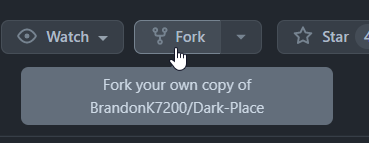
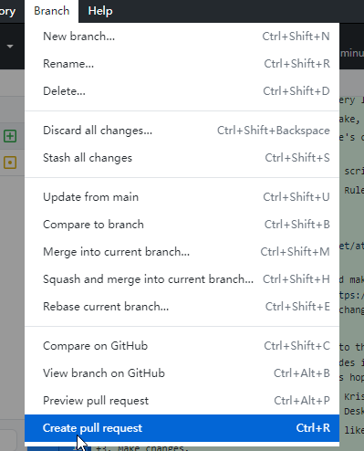
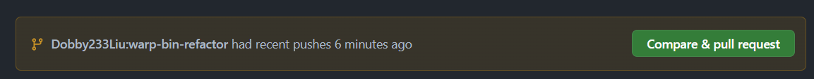
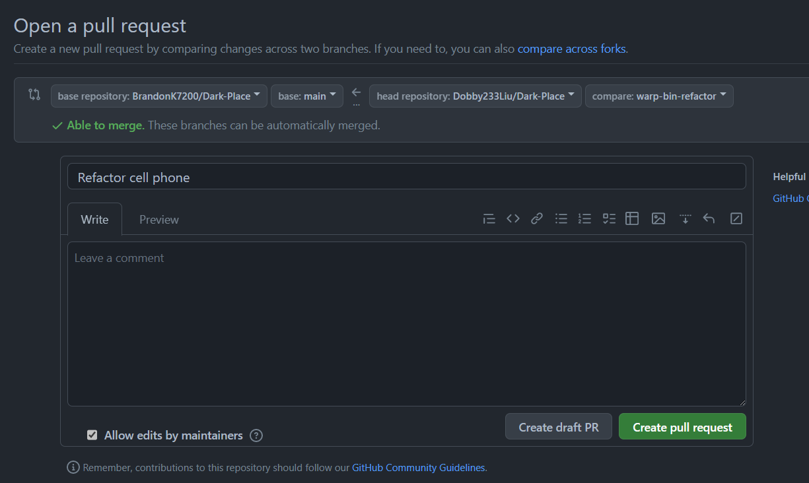

# Contributing

## Contribution Rouxls (Pronounced "Rules")
1. No NSFW, we gotta keep this mod at the very least PG-13.
2. No slurs. This one should be obvious 
3. If you're using assets that you didn't make, be sure to credit the original author(s)!
4. Don't just completely remove someone else's commit, although you can still edit what someone else has made.
5. Don't add doxxing scripts, or really any script that is dangerous to ones safety.
6. Always remember to test your commits before making a pull request. We would like to keep this mod as a bug-free experience.
7. Please don't make us add more rules like Rule 5 please.

## Official Wiki
Go to Dark Place's [official wiki](https://dark-place.fandom.com/wiki/Dark_Place_Wiki) and check out some stuff that has been implemented or WILL be implemented.

## Getting Started


To start contributing to the mod, you should make a fork of our repo on GitHub. To do so, click the "Fork" button in the [GitHub repo](https://github.com/BrandonK7200/Dark-Place), shown in the image above. This creates a place to host your changes to the mod so you can submit it to here later.

Then you can start working on the fork you just made. We can't cover everything about that here, so we suggest you to look for guides if you don't already know how to work with GitHub. Here's a very brief possible workflow that is hopefully useful for reference:
1. Clone your fork to the mods directory of Kristal (`%appdata%\love\kristal\mods` on Windows) with Git's CLI or a visual Git tool, such as GitHub Desktop or Visual Studio Code.
2. Open the repo in the file explorer/a IDE like VS Code.
3. Make changes.
4. Figure out a way to start Kristal whenever you need it, keep it running for as long as you can, and use it to debug your changes.
5. Commit and push your changes to the repo with the 3 tools mentioned in `1.`





When you're done, it's time to make a Pull Request to our repo. If you have GitHub Desktop, you can do this quickly by clicking `Branch -> Create Pull Request` as shown in the first image. Or you can go to your fork's repo with your browser, and when you see the prompt in image 2, click `Compare & pull request`.



You'll be brought to the page shown above. Write helpful text in the textboxs, then click `Create pull request`. Patiently wait for a maintainer to notice, review and merge your PR, and you're done!

Finally, for assistance on various matters in the contribution process, you may join our Discord server. Happy contributing!

## Recommended Extensions for VS Code
This repo suggests installing sumneko's [Lua Language Server](https://marketplace.visualstudio.com/items?itemName=sumneko.lua) and the accompanying [Kristal extension](https://marketplace.visualstudio.com/items?itemName=kristal.kristal-vscode), for more complete syntax highlighting and suggestions during coding. Afterwards, you will need to accept Lua Language Server "configuring your work environment as Kristal".

> [!IMPORTANT]
> There have been reports of the prompt not appearing. For now, you may need to configure Lua Language Server manually, by creating a `.vscode/settings.json` with the following bolierplate:
```json
{
    "Lua.runtime.version": "LuaJIT",
    "Lua.diagnostics.disable": [
        "duplicate-set-field",
        "need-check-nil",
        "undefined-global"
    ],
    "Lua.type.weakNilCheck": true,
    "Lua.type.weakUnionCheck": true,
    "Lua.runtime.builtin": {
        "utf8": "enable"
    },
    "Lua.runtime.special": {
        "modRequire": "require"
    },
    "Lua.workspace.library": [
        "${3rd}/love2d/library",
        "${extensionInstallFolder:kristal.kristal-vscode}/3rd/kristal-lua-docs/library"
    ]
}
```

Optionally, you can also configure the repo for Local Lua Debugger. This allows for quick startup of Kristal for testing, and provides you with various debugging features, though it absolutely can reduce performance. See [this document](libraries/LocalLuaDebuggerIntergration/USAGE.md).

<!-- Not checking in settings.json because the extensionInstallFolder gets expanded to an actual path for whatever reason -->
<!-- Inspired by https://github.com/ba-archive/blue-archive/blob/main/README.md#%E6%AD%A3%E7%A1%AE%E4%BD%BF%E7%94%A8-vscode-%E6%96%87%E4%BB%B6%E5%A4%B9 -->
