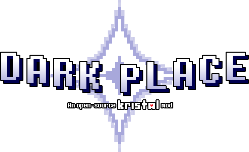

 
<i>Logo by Just another random user. (@JustAnotherRandomGithubUser)</i>

<a href="https://discord.gg/RhqPCA6eFN">Discord Server</a> | <a href="https://darkplace-dr.github.io/">Official Website</a> | <a href="https://dark-place.fandom.com/wiki/Dark_Place_Wiki">Official Wiki</a>

Dark Place is an open source Kristal mod that anyone can contribute to.

Well as it turns out Ralsei was wrong when he said that making Dark Fountains causes The Roaring, they just get weirder the more you make. Susie has been making them left right and center, and she is now on her 1000th fountain. Go and explore the world, there's lots to discover!

## Installation
Those instructions are intended to those who only want to play Dark Place. If you want to contribute, see **[Contributing](#contributing)**.

Installing Kristal's dev version

Kristal is the engine Dark Place was made on. As such, you will need it to play.

For diverse reasons, the mod currently only runs on **0.8.1-dev** which is not a released version, you will need to install the source code version of Kristal which can easily be done with the CI builds.

Simply install [the latest build](https://nightly.link/KristalTeam/Kristal/workflows/ci/main/output.zip) and open the archive.

If you are on Windows, you can simply extract the content of `kristal-0.8.1-dev-win.zip` in a folder anywhere you want on your computer and run the exe.

If you are on Linux or Mac, you'll have to install [LÖVE](https://love2d.org/) beforehand. After that, you can extract `kristal-0.8.1-dev.love` and run the love file.

Downloading Dark Place

After installing Kristal, download the latest version of Dark Place by clicking on the green button and then the "Download ZIP" one.

Once the download is done, open Kristal and look in the main menu for the option called "Open mods folder" and select it. It will open a folder where you will have to place **the content of the archive**.

After that, you can start the mod as you would start any other Kristal mod by choosing "Play a mod" and select Dark Place.

> *Note: if for some reason it doesn't work and you are sure you did everything correctly, join the [Kristal Discord server](https://discord.gg/8ZGuKXJE2C) to ask for help.*

## Contributing
See [CONTRIBUTING.md](CONTRIBUTING.md). **Please make sure to read the aforementioned document before contributing,** as it contains the very important contribution rouxls (pronounced "rules").

## Credits

For Dark Place itself

* Racckoon - Mod idea, Contributor
* BrendaK7200 - Making the GitHub page, Contributor
* AcousticJamm - Name idea, Contributor
* Anonymously_Present - Contributor
* Simbel - Contributor
* Just Another Random User - Contributor
* Charbomber - Contributor
* Bor - Contributor
* vitellary - Contributor
* Dobby233Liu - Contributor
* Willow with a W - Contributor
* Kross - Contributor
* Agent 7 - Contributor
* Riverstar (Sumire) - Contributor
* AlexGamingSW - Contributor
* Tick - Contributor
* PatateAuBeurr - Contributor
* SciSpaceProductions - Contributor
* Nyako - Contributor
* Sam Deluxe - Contributor
* Silvaz - Contributor
* LancerGaming2 - Contributor
* FireRainV - Contributor
* Sad Diamond Man - Contributor
* Bryan The Celestial - Contributor
* YoshifanJordan - Contributor
* NelleMonelle - Contributor

For used assets

* Kristal Team - Creating the Kristal engine
* Toby Fox - Original author for Undertale and Deltarune
* Lena Raine - Composer for "Hug for Ralsei" and "Lullaby for Lancer"
* KateBulka - Shadowman Library, Light Transition Library, & more
* HUECYCLES - Custom BG Library code
* Team UTY - Original authors of Undertale Yellow.
* Brylee - Original author for Deltarune: Ozymandias, dialogue portraits for Rook
* Mr. Luwigi - Rook, DZ & NG sprites for Deltarune: Ozymandias
* TrashcatYT - Blue Soul Library
* Glavvrach - Splitting effect for SNEO bullets
* Scarm - GM path system and Gaster Blaster libraries.
* TheMaxine - Original author for [Ribbit](https://gamejolt.com/games/ribbitmod/671888)
* lvk, RhenaudTheLukark - Original authors for [Unitale](https://github.com/lvk/Unitale) and [Create Your Frisk](https://github.com/RhenaudTheLukark/CreateYourFrisk)/[Create Your Kris](https://github.com/RhenaudTheLukark/CreateYourKris)
* STD Repaints - Original author for [Deltarune Repainted](https://gamejolt.com/games/nudealert/496504)
* RynoGG - Original author for [Deltatraveler](https://gamejolt.com/games/deltatraveler/661464)
* Team Inundation - Original authors for MOBDT
* Stardust - [NYCTBA Earthbound Remix](https://soundcloud.com/speedwaystardst/nows-your-chance-to-be-a-earthbound-remix)
* MrkySpices - Deltarune-styled Backrooms tileset
* OMOCAT, LLC - Original author for OMORI
* Ninomae Ina'nis - Creator and designer of the Takodachis
* Nintendo - Original authors for Pikmin
* HAL Laboratories - Original author for Kirby
* Tour de Pizza - Original authors for Pizza Tower
* Eminus - Original author for Mario's Mystery Meat
* Lester Vine - Original author of Super Diagonal Mario 2
* Askywalker - Original author of Starwalker party sprites
* Discarded_Vessel - Original author of Kris LW battle sprites
* AccurateJaney - Original author of Susie and Noelle LW battle sprites
* ATLUS - Original authors of SMT and every single SMT spinoff ever
* Findus - Creator of Croustibat
* Scott Cawthon - Creator of the Five Nights at Freddy's franchise
* MoviesMovies1 - [U.N Owen Was Her? 8 Bit Remix](https://www.youtube.com/watch?v=YJ3LH6u8G1M)
* The Caretaker - Creator of the [Everywhere at the End of Time](https://thecaretaker.bandcamp.com/album/everywhere-at-the-end-of-time) album
* SEGA & Sonic Team - Original creators of Sonic.
* Rovio Entertainment Ltd. - Original creators of Angry Birds.

